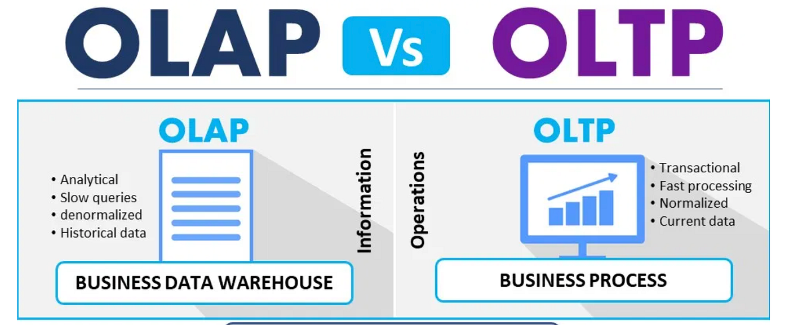
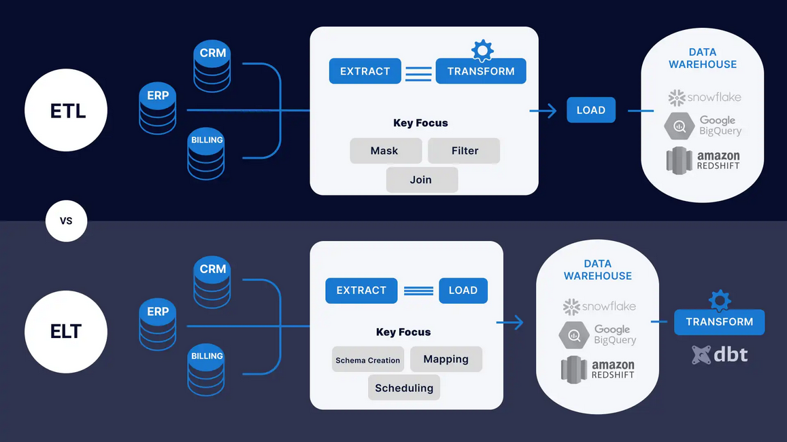

# 🔍 Pesquisa de Fundamentos e Modern Data Stack

> "A excelência não é um ato, mas um hábito de preparação contínua."

## 📖 Introdução e Justificativa

Este documento é o resultado de uma imersão técnica realizada de forma antecipada, utilizando como bússola as diretrizes apresentadas no **Módulo Zero** do programa Lighthouse. 

Diferente de uma pesquisa genérica, este levantamento foi estruturado a partir dos **Guias de Estudo oficiais** (Analytics Engineering, Data Engineering, Data Science e IA) e das sessões de **Data Talks** disponibilizadas pela Indicium. A decisão de consolidar estes conceitos antes do início das aulas práticas fundamenta-se em três pilares estratégicos:

### 🎯 Por que iniciar esta pesquisa a partir do Módulo Zero?

1.  **Alinhamento com a Metodologia Indicium:** O Módulo Zero deixou claro que a transição para carreiras de dados exige uma mudança de mindset. Esta pesquisa visa sedimentar o "pensamento de Analytics Engineer" e a compreensão da Modern Data Stack (MDS) antes da execução técnica.
2.  **Otimização do Ciclo de Aprendizado:** Ao estudar previamente os temas sugeridos nos guias de Engenharia e Analytics, garanto que o tempo das aulas ao vivo será utilizado para discussões de alto nível e resolução de problemas complexos, maximizando o aproveitamento da mentoria.
3.  **Resposta à Proatividade Exigida:** As trilhas de carreira e os talks sobre "como aprender tecnologia de forma eficiente" enfatizaram que a autonomia é um diferencial no Lighthouse. Este documento é a aplicação prática dessa orientação: transformar as referências teóricas do Módulo Zero em conhecimento estruturado.
4.  **Visão Holística (Full Stack Data):** Inspirado pela variedade de guias (Data Analytics a IA), busquei entender como essas áreas se conectam dentro da arquitetura que a Indicium implementa, garantindo uma visão sistêmica do pipeline de dados.

---

## 🛠️ Eixos de Estudo (Diretrizes do Módulo 0)

Com base nos referenciais técnicos apresentados nos guias de estudo, esta pesquisa foca em:

* **Fundamentos Analíticos:** Diferenciação entre ambientes transacionais (OLTP) e analíticos (OLAP).
* **Modelagem de Dados:** O pilar da Analytics Engineering conforme sugerido na "Aula Zero".
* **Arquitetura de Nuvem:** O papel dos Cloud Data Warehouses na escalabilidade de projetos.
* **Ferramental Estratégico:** Introdução conceitual ao dbt e práticas de versionamento.

---

## 🗄️ Arquiteturas de Processamento: OLTP vs. OLAP

Para dominar a Engenharia de Dados, é fundamental entender onde os dados nascem e para onde eles vão. Abaixo, detalho as duas arquiteturas principais com base nas definições técnicas da IBM.

### 1. OLTP (Online Transactional Processing)
O foco aqui é a **execução**. São sistemas voltados para transações rápidas e frequentes.

* **Funcionamento:** Processa grandes volumes de transações simples (INSERT, UPDATE, DELETE) de forma simultânea.
* **Características Principais:**
    * **Alta Disponibilidade:** Precisa estar no ar 24/7 (ex: sistema de um banco).
    * **Velocidade:** Respostas em milissegundos.
    * **Normalização:** Dados são organizados para evitar redundância (geralmente em várias tabelas relacionadas).
    * **Propriedades ACID:** Garante que as transações sejam Atômicas, Consistentes, Isoladas e Duráveis.
* **Exemplos Práticos:**
    * Sistemas de PDV (caixa de supermercado).
    * Aplicativos de Internet Banking.
    * Sistemas de reserva de passagens aéreas.

### 2. OLAP (Online Analytical Processing)
O foco aqui é a **análise**. São sistemas voltados para consultas complexas e grandes volumes históricos.

* **Funcionamento:** Consolida dados de diversas fontes OLTP para permitir descobertas, relatórios e BI.
* **Características Principais:**
    * **Multidimensionalidade:** Permite analisar dados sob diferentes perspectivas (Tempo, Geografia, Produto).
    * **Dados Históricos:** Armazena dados de meses ou anos para identificar tendências.
    * **Consultas Complexas:** Frequentemente envolve agregações (`SUM`, `AVG`, `COUNT`) em milhões de linhas.
    * **Desnormalização:** Dados são organizados para performance de leitura (ex: Star Schema).
* **Exemplos Práticos:**
    * Relatórios de vendas anuais comparativos.
    * Previsão de demanda de estoque.
    * Análise de comportamento do consumidor (Churn).

---

### 📊 Tabela Comparativa

| Característica | OLTP (Transacional) | OLAP (Analítico) |
| :--- | :--- | :--- |
| **Objetivo** | Executar o negócio (Operacional) | Analisar o negócio (Estratégico) |
| **Fonte de Dados** | Operações em tempo real | Dados consolidados de OLTPs |
| **Queries** | Simples e rápidas | Complexas e demoradas |
| **Volume de Dados** | Gigabytes (dados atuais) | Terabytes/Petabytes (histórico) |
| **Usuários** | Clientes, atendentes, sistemas | Analistas, Cientistas de Dados, Diretores |

---

### 💡 Modern Data Stack
Na consultoria, o Engenheiro de Dados utiliza processos de **ELT** para extrair dados de sistemas **OLTP** (Postgres, MySQL, APIs) e carregá-los em um ambiente **OLAP** (Snowflake, BigQuery). Uma vez no ambiente OLAP, usamos o **dbt** para transformar esses dados brutos em modelos dimensionais que facilitam a vida do analista de BI.

---

### 🧊 O Conceito de Cubo OLAP
Diferente de uma tabela 2D (linhas e colunas), um **Cubo OLAP** é uma estrutura multidimensional que permite visualizar dados através de várias "dimensões".

* **Funcionamento:** Imagine um cubo onde uma face é o **Tempo** (anos/meses), outra é o **Produto** e a outra é a **Região**. O valor dentro do cubo (a **Métrica**) seria o total de vendas.
* **Operações Principais:**
    * **Drill-down:** Aumentar o detalhe (ex: de Ano para Meses).
    * **Roll-up:** Consolidar os dados (ex: de Cidades para Estados).
    * **Slice & Dice:** Filtrar e "fatiar" o cubo para ver apenas uma parte específica.

---

### 🚀 Variações de Arquitetura OLAP

Dependendo de como os dados são armazenados e processados, o OLAP se divide em três modelos principais:

#### 1. MOLAP (Multidimensional OLAP)
Os dados são armazenados em cubos proprietários, altamente indexados e pré-calculados.
* **Uso:** Quando a performance de leitura é crítica e as consultas são repetitivas.
* **Prós:** Velocidade absurda em grandes volumes.
* **Contras:** Menos flexível; se você precisar de uma análise que não foi pré-calculada, o sistema sofre.

#### 2. ROLAP (Relational OLAP)
Os dados permanecem em bancos de dados relacionais tradicionais. A "lógica do cubo" é aplicada via SQL complexo em tempo de execução.
* **Uso:** Quando os dados mudam com frequência ou a flexibilidade de consulta é prioridade.
* **Prós:** Escalável e utiliza a infraestrutura SQL já existente.
* **Contras:** Pode ser mais lento que o MOLAP para agregações massivas, pois processa tudo na hora.

#### 3. HOLAP (Hybrid OLAP)
O "melhor dos dois mundos". Mantém os dados detalhados no banco relacional (ROLAP) e as agregações pré-calculadas em cubos (MOLAP).
* **Uso:** Grandes corporações que precisam de detalhe máximo e velocidade em relatórios executivos.

---

### ☁️ OLAP na Nuvem

Antigamente, manter sistemas OLAP exigia servidores gigantescos e caros. Hoje, a **Modern Data Stack** mudou o jogo com o **Cloud OLAP**.

* **Arquitetura Desacoplada:** Ferramentas como **Snowflake** e **BigQuery** separam o Armazenamento (Storage) do Processamento (Compute). Você paga apenas pelo que usa.
* **Elasticidade:** Se você precisa rodar uma query em 1 bilhão de linhas às 9h da manhã, a nuvem escala 100 servidores para você e depois os desliga.
* **Diferencial técnico:** No Cloud OLAP moderno, a distinção entre ROLAP e MOLAP ficou tênue, pois o processamento em nuvem é tão rápido que muitas vezes não precisamos mais "pré-calcular" cubos rígidos.

---

## 🔄 Integração de Dados: ETL vs. ELT

A integração de dados é o processo de combinar dados de múltiplas fontes em um repositório centralizado. A principal diferença entre ETL e ELT reside na ordem em que os dados são transformados e onde esse processamento ocorre.

### 1. ETL (Extract, Transform, Load)
No modelo tradicional, os dados são transformados em um servidor secundário (staging area) antes de serem carregados no destino final.

* **Funcionamento:** Os dados são extraídos das fontes, passam por um processo de limpeza e formatação fora do banco de dados de destino e, somente após estarem "prontos", são carregados no Data Warehouse.
* **Características Principais:**
    * **Processamento Externo:** Depende de motores de processamento dedicados para a transformação.
    * **Conformidade e Privacidade:** Ideal para remover dados sensíveis (LGPD/GDPR) antes mesmo de chegarem ao armazenamento.
    * **Estrutura Rígida:** Requer que o esquema de destino seja definido antes da carga (Schema-on-write).
* **Uso Ideal:** Ambientes com dados altamente estruturados e limitações de processamento no banco de dados de destino (Sistemas On-premise).

### 2. ELT (Extract, Load, Transform)
O modelo moderno, impulsionado pela computação em nuvem, onde o dado bruto é carregado diretamente e a transformação utiliza o poder do destino.

* **Funcionamento:** Os dados são extraídos e carregados imediatamente no Data Warehouse ou Data Lake. A transformação ocorre internamente, utilizando SQL ou linguagens de processamento distribuído.
* **Características Principais:**
    * **Alta Escalabilidade:** Utiliza a elasticidade de Cloud Data Warehouses (como Snowflake e BigQuery).
    * **Flexibilidade:** Permite carregar dados brutos sem uma estrutura pré-definida (Schema-on-read), facilitando análises futuras.
    * **Velocidade de Ingestão:** O processo de carga é muito mais rápido, pois não há o gargalo da transformação prévia.
* **Uso Ideal:** Big Data, Modern Data Stack e projetos que exigem agilidade na disponibilização de novos dados.

---

### 📊 Comparativo Técnico

| Característica | ETL (Tradicional) | ELT (Moderno) |
| :--- | :--- | :--- |
| **Sequência** | Extrair → Transformar → Carregar | Extrair → Carregar → Transformar |
| **Local de Transformação** | Servidor de Processamento Independente | No próprio Data Warehouse/Lake |
| **Tempo de Carga** | Mais lento (devido à transformação) | Mais rápido (carga direta) |
| **Volume de Dados** | Ideal para volumes pequenos/médios | Projetado para Petabytes e Big Data |
| **Manutenção** | Alta (mudanças na fonte quebram o fluxo) | Baixa (o dado bruto está sempre disponível) |

*Fonte das informações: Indicium Academy, AWS, Databricks.*

---
